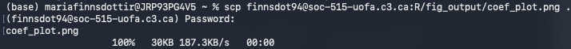

# Submitting an R batch job

Now that we have our R script written for a cluster job, we need to write a script that runs that job. We'll use `nano` again here. 

The first step in writing your job script is to define the script interpreter (basically, telling the shell what language we'll be using):

```shell
#!/bin/bash
```

In this case, we're telling the shell that we're coding in bash. 

Next, we need to define the requests in our job so that the scheduler knows how much memory, how much time, and how much compute (CPUs or GPUs) we need. Here, since we're running a pretty small job, we'll just ask for 30 minutes, 1GB of memory, and 1 CPU. We'll also give our job a name so that it's easy to find in the queue. 

```shell
#SBATCH --time=00:00:30
#SBATCH --mem_per-cpu=1G
#SBATCH --cpus-per-task=1
#SBATCH --job-name="marias_lm"
```

While you do need to specify how much time you need for every job, you can choose not to specify your memory or compute needs. In those cases, you will be alloted a default amount by the system (256MB per core of memory, and one core). You would only ever use more than one core if your script was set up to run in parallel. 

!!! note ""
    For a full list of the options you can use to describe your job with SBATCH, you can run the following command `sbatch --help`. You can also find more information on setting up and running jobs in the [Alliance documentation](https://docs.alliancecan.ca/wiki/Running_jobs#Use_sbatch_to_submit_jobs). 

The last thing we need to do in our job script is to load an R module and run our R script. If your R script is not in the same folder as your job script, you'll need to add the file path. 

```shell
module load r/4.5.0
Rscript shell_script.R
```
To save your script, press ++cmd+o++ (on mac) or ++ctrl+o++ (on windows). It will prompt you to name the file and save it. I've named mine `shell_job.sh`. Then you can press ++cmd+x++ (on mac) or ++ctrl+x++ (on windows) to close the text editor. 

Next, to run your job, call `sbatch` followed by the same of your job script. When your job is submitted, there should be a line of output printed to the console with the name of your job, like this: 

```shell
sbatch shell_job.sh
Submitted batch job 19
```

While it is running, you can watch its progress by calling `squeue` followed by your username, like so:

```shell
squeue -u finnsdot94
```

This command will print out information about your job, including:

- the job ID,
- the job name,
- the state of the job (R for running, PD for pending, and CG for completing),
- and the time remaining on the job.

<figure markdown="span">
    {width=600}
    <figcaption></figcaption>
</figure>

If you just call `squeue` alone, you'll get a list of all the jobs in the queue. For 

Once your job is finished running, it will produce an output file called "slurm-##.out". You can open this file using `nano`. In it, you will find information about the status of your job (for example, where it failed if it did) as well as any output you printed from the R console.  

## Monitoring and evaluating a job.

Determining how much time and memory you need for a job is, to some extent, a trial and error sort of thing. (Remember, unless you're doing parallel processing, you're only using one core). Luckily, there are ways to measure how much memory your job is using, allowing you to refine your requests. 

It is generally good practice to request only as much as you need. Smaller jobs tend to run faster, and less wasteful jobs make the system run smoother for everyone. 

One way to tell if your job needed more memory or time than it had is to check the slurm output file. If you ran out of memory, you will find an "oom-kill" error. If you included printed checkpoints (like we did) you can also use those to judge whether your job needed more time than you give it. 

You can also use the command `sacct` after your job is done running to evaluate it. `saact` displays account data for all jobs and job steps in the log (for more on the command, check out the [documentation](https://slurm.schedmd.com/sacct.html)). Let's try running it now to see how much time our job took and how much memory it used: 

```shell
sacct -o JobID,MaxRSS,Elapsed -j 19.batch
```

In the above block of code, `-o` refers to our request for format. In this case, we are only asking for the job id, the memory used, and the time elapsed - in that order. We then use the argument `-j` to specify the job, and follow it with our job id. 

This command produces the following output in the shell:

```shell
JobID            MaxRSS    Elapsed 
------------ ---------- ---------- 
19.batch        187932K   00:01:06 
```

According to this, our job used 187932KB of memory (or, 187.8MB) and only 1 minute and 6 seconds. Based on this, next time we run this or a similar job, we should decrease our memory and time requests. 

For a full list of the formatting options, run `sacct --helpformat`.

???note "Evaluate your job while it is running"

    You can also check currently running jobs by using the `sstat` command followed by your job ID. You will also need to specify what information you want and how you want it formatted (otherwise it will print out a huge amount of data on your job), For example, to ask it to display how much memory is being used by job 16 in real time:

    ```shell
    sstat 16.batch --format="JobID,MaxRSS" 
    ```
    The code above specifies that this is job 16 and asks for the output to be given in the format of job id and then memory, like so:

    ```shell
    JobID            MaxRSS 
    ------------ ---------- 
    16.batch        188044K 
    ```

    For a complete list of what options you can use with the `sstat` command, run the following:

    ```shell
    sstat --help
    ```

## Downloading our output.

Now that we've run our analyses, let's quickly check that our outputs were produced and are in the right places. We should have two csv tables with our tidy linear regression outputs in the `table_output` folder, cleaned data in our `data_output` folder, and a coefficient plot in our `fig_output` folder. 

To look inside the folders without having to change directories, we can use the `ls` command followed by the subfolder name:

```shell
ls fig_ouput
```
Check all three folders and make sure that all your output saved properly. Once you are sure that it did, you can close your remote session. To do so, simply use the command `exit`.

Now that we are working locally, we can download our files from the remote server. We'll do this with `scp` (secure copy program). First, we need to call `scp` followed by arguments that describe:

- Our username in the remote system
- The address of the remote system
- The location and name of the file we want to download
- The location we want the file to be downloaded to

Let's try this first with our coefficient plot, inside the `fig_output` folder. Let's save it to our current working directory by using `.` as the location. 

```shell
scp finnsdot94@soc-515-uofa.c3.ca:R/fig_output/coef_plot.png .
```

In the code above, I first call `scp`, then enter my username `@` the remote server's address. The name and location of the file come next, after a colon `:`. Finally, I've used a period `.` to tell the computer to save the file in my current working directory. You can also put a file path in place of the period to save your files elsewhere. 

Once you've pressed enter on that command, you will be prompted to enter your password. Once you've succesfully connected, you should see the status of your download pop up in the shell. 

<figure markdown="span">
    {width=600}
    <figcaption></figcaption>
</figure>

We also have the option to download and save more than one file at a time using wildcards `*`. Let's use the wildcard character to download both csv files from our `table_output` folder at the same time. 

```shell
scp "finnsdot94@soc-515-uofa.c3.ca:R/table_output/*.csv" .
```

You should notice that, in addition to using a wildcard instead of a file name, we've also had to enclose our username, address, and file request in quotation marks. 

Finally, use `scp` to download our cleaned/modified data file. 

???note "Solution."
    ```shell
    scp finnsdot94@soc-515-uofa.c3.ca:R/data_output/modified_nlsc_data.csv .
    ```
