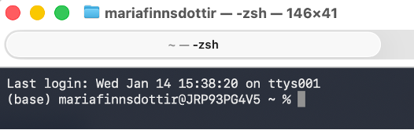

# Crashcourse: R, HPC and the shell.

Before we dive into how to do analyses using R on  high-performance computing clusters, let's start with a crashcourse in HPC and the shell.

## What is high-performance computing? 

High-performance computing (also known as supercomputing) is a form of computing that uses multiple, linked, powerful CPUs/GPUs to handle fast, more intense, and larger processing. The principle tool for HPC is the computing cluster. 

**Key terms.**
- Core: One processing unit (CPU or GPU)
- Node: basically a computer (processors, memory, hard disc...) without all the accessories
- Cluster: collection of many connected nodes
- Rack: The box holding the cluster together

## Using the shell.

Basically, the shell is the program that lets you interact with the computer behind the click and point interface we all use. The application we use to access the shell differs across operating systems:

- On Mac and linux machines, use the 'Terminal' to access the shell
- On newer Windows computers (version 10 or above), you can access the shell through the 'Command Prompt' application
- On older Windows computers, you will need to download specialized software to access the shell, such as the free version of [MobaXterm](https://mobaxterm.mobatek.net/download.html). 

Once you open the terminal, you will seem the command prompt. The prompt itself can be customized, and will look different based on your operating system. It is called a prompt because it is waiting (or, prompting) you to enter a command. 

<figure markdown="span">
    {width=800}
    <figcaption>My command prompt shows my username and computer name, followed by my working directory (blank) and the % symbol. </figcaption>
</figure>

## Logging into the HPC cluster.

You must use SSH to log into the clusters

The first time you log in, you 