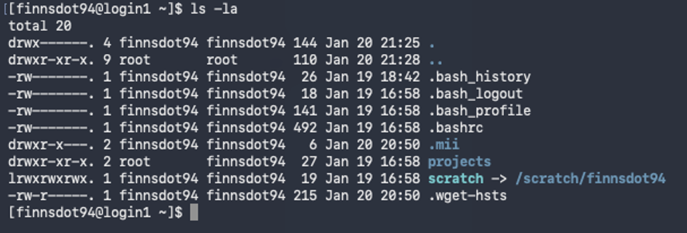

# Crashcourse: Using the shell. 

Before we dive into how to do analyses using R on  high-performance computing clusters, let's start with a crashcourse in HPC and the shell.

## What is high-performance computing? 

High-performance computing (also known as supercomputing) is a form of computing that uses multiple, linked, powerful CPUs/GPUs to handle fast, more intense, and larger processing. The principle tool for HPC is the computing cluster. 

**Key terms:**

- Core: One processing unit (CPU or GPU)
- Node: basically a computer (processors, memory, hard disc...) without all the accessories
- Cluster: collection of many connected nodes
- Rack: The box holding the cluster together

The Digital Research Alliance of Canada provides access to HPC clusters to Canadian researchers free of charge. For more information about how to access these and other resources, please visit the [Alliance's documentation](https://docs.alliancecan.ca/wiki/National_systems#Compute_clusters). 

## Using the shell.

Basically, the shell is the program that lets you interact with the computer behind the click and point interface we all use. The application we use to access the shell differs across operating systems:

- On Mac and linux machines, use the 'Terminal' to access the shell
- On newer Windows computers (version 10 or above), you can access the shell through the 'Command Prompt' application
- On older Windows computers, you will need to download specialized software to access the shell, such as the free version of [MobaXterm](https://mobaxterm.mobatek.net/download.html). 

Once you open the terminal, you will seem the command prompt. The prompt itself can be customized, and will look different based on your operating system. It is called a prompt because it is waiting (or, prompting) you to enter a command. 

<figure markdown="span">
    {width=600}
    <figcaption>My command prompt shows my username and computer name, followed by my working directory (blank) and the % symbol. </figcaption>
</figure>

To use the shell, we type in commands, which the program then interprets. For example, if we type in `whoami`, it returns our username:

```shell
(base) mariafinnsdottir@JRP93PG4V5 ~ % whoami
mariafinnsdottir
```
??? note "What is happening here?"

    1.	The terminal takes this string of characters “whoami” and looks in a special set of directories on your computer called the PATH for any files that match the string
    2.	If it finds a match, run the file as a program
    3.	whoami is recognized as a program
    4.	That program then returns a result based on how it was programmed

If, however, we type a command that the program does not recognize, it will return an error.   

```shell
(base) mariafinnsdottir@JRP93PG4V5 ~ % whereami
zsh: command not found: whereami
```

The correct way to find 'where we are,' so to speak, is to print the working directory. We do this using the `pwd` command. 

Mac and Linux users will see the `pwd` command return the current working directory:

```shell
(base) mariafinnsdottir@JRP93PG4V5 ~ % pwd
/Users/mariafinnsdottir
```

Windows users will get a 'command not found' error here as well, because the original operating system programmers named the command `cd` (current directory) instead. If you’re working on a Windows computer, type in `cd` now, and the shell should return your current working directory.

Even with the differences between operating systems, typically, you can do the same things. Once we log into the remote system, everyone will see the same thing and will use the same commands.

!!! Note
    You can navigate through your previous commands using the up and down arrow buttons. You can also view a list of previous commands by running the command `history`.

## Logging into the HPC cluster.

In order to log into one of the Alliance's clusters, we need to use a secure shell remote login client; the command for this is `ssh`. The basic structure of the command is: 

```shell
ssh username@remote_system_url
```

The arguments in this command are (1) the username you've been assigned in the remote system, and (2) the URL/address of the system you are trying to connect to. To log in to an Alliance cluster, you will use your [CCDB](https://www.alliancecan.ca/en/our-services/advanced-research-computing/account-management/apply-account) username and the [address of one of the clusters](https://docs.alliancecan.ca/wiki/National_systems#Compute_clusters). For example: 

```shell 
ssh user000@fir.alliancecan.ca
```

The first time you log in to a system, you will get a warning message with a fingerprint challenge alerting you that your computer doesn't recognize the key fingerprint of the remote system. 

<figure markdown="span">
    {width=600}
    <figcaption> </figcaption>
</figure>

!!! note "Reasons you might see a fingerprint challenge when logging in:" 

    1. This is your first connection with the specific cluster.
    2. You have removed the cluster address entry from your computer’s ~/.ssh/known_hosts file. This file contains the key fingerprints of remote systems you have previously connected to. When you start an SSH session, ssh checks the key fingerprint in this file to the one presented during an SSH connection attempt. If they are different, it will ask you to confirm the connection attempt.
    3. The servers ssh configurations have been updated, causing the key fingerprint to change. Before confirming the connection, contact the server administrators to confirm the update before continuing. The Alliance cluster key fingerprints are available for comparison on the technical documentation wiki [SSH Security Improvements](https://docs.alliancecan.ca/wiki/SSH_security_improvements#SSH_host_key_fingerprints) page.
    4. A bad actor has created an on-path cyberattack to capture your username and password for future use.

Type `yes` to continue connecting to the remote system only if reasons 1, 2, or 3 explain why you are seeing the challenge message. 

When you type your password in, you will **not see anything appear on the screen**: your password will not be printed, nor will you see any key stroke indicators like dots or asterisks. This means you need to be extra careful typing your password - entering an incorrect password more than a few times will cause the system to block your connection attempts for some period of time before you can try again. 

The Alliance clusters use [multifactor authentication](https://docs.alliancecan.ca/wiki/Multifactor_authentication) for logging in, meaning that you will need to have it set up before trying to connect to a cluster.

## Working in the remote system shell.

The first thing you will notice is a change to the prompt in your terminal, indicating that you are on a different system. Your prompt should now display your username, the remote system's hostname, the current working directory, and then a prompt symbol. 

```shell 
[finnsdot94@login1 ~]$ whoami
finnsdot94
[finnsdot94@login1 ~]$ pwd
/home/finnsdot94
```

Above, you can see that my name in this remote system is `finnsdot94` and that I am currently connected to the `login1` node (the first node on the cluster) and working in the highest-lvel working directory.

Now, let's see what else is in our working directory. To list the files and folders in your working directory, use the command `ls`. Since we haven't added any files or folders yet, you should just see the default `project` and `scratch` directories. 

The `ls` command can be modified to give you more informaiton with a number of options, such as `-a` which will include hidden entities, or `-l` which will provide a more detailed output. These options can also be combined, like below: 

<figure markdown="span">
    {width=600}
    <figcaption> </figcaption>
</figure>

For information about all the options available with a command, type the command followed by `--help` and hit enter.

Finally, you can navigate between directories using the command `cd` which here means 'change directory'. To move into another directory, type the command `cd` followed by the cane of the directory you'd like to move into. Here, I'm using `cd` to move into `projects`:

```shell
[finnsdot94@login1 ~]$ cd projects
[finnsdot94@login1 projects] $
```

You'll notice that now the wokring directory location in my prompt has changed from `~` to `projects`. You can move back up to the home directory by using the command `cd ..`.

!!! note "Navigating the file system."

    File systems in our computer are best thought of as hierarchical or nested systems. Our home working directory is the highest level, with every other directed nested inside. 
    
    You can move across multiple levels with one `cd` command, so long as you specify the file path. So, to move down two levels, you would need to use `cd folder/subfolder` or to move up two levels, you'd use `cd ../..`

